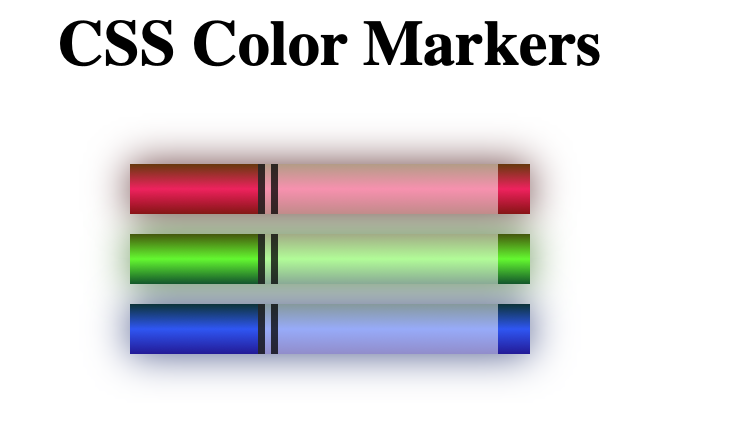

# 🖊️ CSS Marker Effect  

A small **CSS design project** that simulates a marker pen effect using gradients and box shadows in pure CSS.  

## 🚀 Technologies Used  
- **CSS3** – Uses `linear-gradient` for color blending and `box-shadow` for a glowing effect  
- **HTML5** – Basic structure  

## 🎨 Screenshot  
  

## 🔗 Live Demo  
➡ [View the Project]https://cxcxkx.github.io/css-marker/

## 📂 Installation  
1. **Clone the repository:**  
   ```bash
   git clone https://github.com/cxcxkx/css-marker.git
